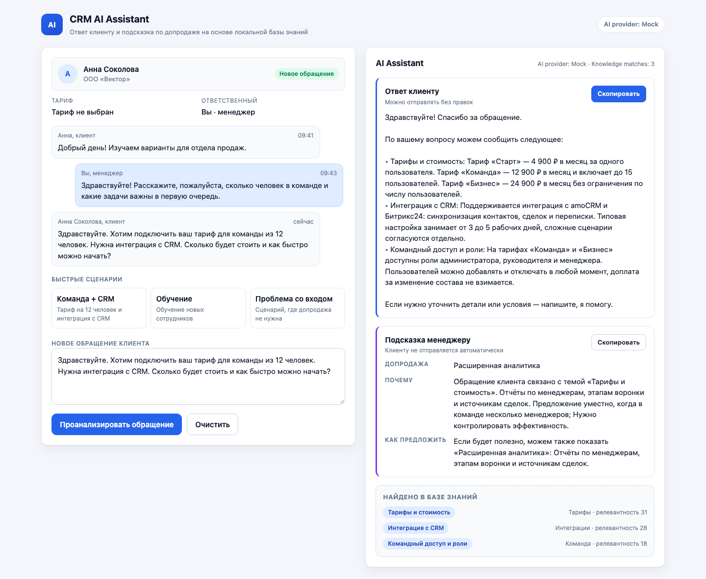

# CRM AI Assistant — прототип AI-ассистента менеджера

Демонстрационный прототип: менеджер вставляет обращение клиента, ассистент сверяется с локальной базой знаний и выдаёт **два независимых результата** — готовый ответ клиенту и внутреннюю подсказку по допродаже.

Проект намеренно небольшой: это не enterprise-система, а аккуратно собранный и полностью работающий vertical slice.

**Демо (production):** https://o-kompleks-five.vercel.app/ — на Vercel `/api/ai` работает через DeepSeek в live-режиме; без переменных окружения автоматически включается mock.

## Что делает

- принимает обращение клиента (вручную или через готовый demo-preset);
- находит релевантные статьи в локальной базе знаний (5–10 записей, без vector DB);
- отправляет в LLM только эти выдержки;
- раздельно формирует ответ клиенту и подсказку менеджеру по допродаже;
- показывает, какие статьи базы знаний использованы;
- честно сообщает, когда данных нет или допродажа неуместна;
- работает без API-ключей в mock-режиме.

## Основной flow

1. Слева — карточка клиента и история диалога в стилистике рабочего окна CRM.
2. Менеджер выбирает быстрый сценарий или вставляет своё обращение.
3. Нажимает «Проанализировать обращение».
4. Справа появляются блок «Ответ клиенту» и блок «Подсказка менеджеру», а под ними — список найденных статей.
5. Любой блок можно скопировать одной кнопкой.

## Как это выглядит



## Стек

| Слой | Технологии |
| --- | --- |
| Frontend | React 19, TypeScript (strict), Vite |
| BFF | Vercel Serverless Function (Node), тот же обработчик в dev-сервере Vite |
| AI | единый provider adapter: Mock, OpenAI, DeepSeek |
| Валидация | Zod (runtime-проверка ответа модели) |
| Тесты | Vitest, React Testing Library, Playwright |
| Качество | ESLint (flat config), TypeScript strict |

## Архитектура

```
React UI
  -> /api/ai          (serverless-функция Vercel или dev-middleware Vite)
     -> retrieveKnowledge()   локальный детерминированный поиск по KB
     -> AiProvider            mock | openai | deepseek
     -> Zod-валидация ответа LLM
  <- { result, knowledgeMatches, provider }
```

Ключевые принципы:

- UI ничего не знает о конкретной модели — только контракт `AiProvider`;
- ключи читаются только на сервере и никогда не попадают в клиентский bundle;
- провайдерная логика не размазана по приложению;
- в mock-режиме приложение полностью работоспособно без ключей.

## Структура проекта

```
api/ai.ts                         serverless-функция Vercel
src/
  app/                            корневой экран и стили
  features/analyze-request/       клиент API, хук состояния, карточки результата
  entities/conversation/          карточка клиента, история, demo-presets
  entities/knowledge/             отображение найденных статей
  shared/api/contracts.ts         общий контракт UI <-> BFF <-> провайдеры
  shared/lib/                     normalize + retrieval
  shared/data/knowledge-base.json демо-база знаний
  server/ai/                      prompt, схема, провайдеры, обработчик
e2e/                              Playwright-сценарии
```

## База знаний

Данные лежат в `src/shared/data/knowledge-base.json`. Записей восемь: тарифы, командный доступ, интеграция с CRM, сроки подключения, поддержка, обучение, модуль аналитики и пакет автоматизации.

Формат записи:

```ts
type KnowledgeItem = {
  id: string
  title: string
  category: string
  content: string
  keywords: string[]
  upsell?: { product: string; conditions: string[]; description: string }
}
```

## Как работает retrieval

Поиск реализован отдельным чистым модулем `src/shared/lib/retrieval.ts` и не требует embeddings:

1. нормализация текста (нижний регистр, ё → е, удаление пунктуации);
2. токенизация с отбрасыванием стоп-слов и грубым усечением русских окончаний;
3. взвешенный score по полям: title (5), keywords (4), category (3), content (1), плюс бонус за точное вхождение заголовка;
4. сортировка и выбор top-3 статей;
5. в LLM уходят только эти три статьи.

Поиск полностью детерминирован — это удобно и для демо, и для тестов.

## AI provider adapter

Единый контракт:

```ts
interface AiProvider {
  readonly name: AiProviderName
  generateAnalysis(input: AiAnalysisInput): Promise<AiAnalysisResult>
}
```

Реализации:

- `MockAiProvider` — собирает ответ из фактически найденных статей и подбирает upsell по смыслу запроса;
- `OpenAiProvider` и `DeepSeekProvider` — используют общий OpenAI-совместимый transport, отличаются только конфигом (baseUrl, model, key).

Чтобы добавить OpenRouter, Gemini или Anthropic, достаточно зарегистрировать нового провайдера в `src/server/ai/providers/index.ts` — UI и контракт не меняются.

### Prompt engineering

Системный prompt жёстко запрещает придумывать цены, сроки и функции и требует опираться только на переданные выдержки. Пользовательский prompt разделён на три блока: «ДАННЫЕ КЛИЕНТА», «БАЗА ЗНАНИЙ», «ЗАДАЧА». Модель обязана вернуть строгий JSON, который затем проверяется Zod. Malformed JSON не доходит до UI — превращается в понятное состояние ошибки.

## Запуск

```bash
npm install
npm run dev
```

Откройте адрес, который напечатает Vite (обычно http://localhost:5173).

В dev-режиме `/api/ai` обслуживает middleware Vite, который использует тот же обработчик, что и serverless-функция на Vercel. Отдельный backend запускать не нужно.

## Mock-режим

Mock включён по умолчанию, если не задан ни один API-ключ. Приложение работает полностью без секретов и покрывает три демо-сценария:

1. команда + CRM → ответ по тарифам и интеграции и допродажа аналитики;
2. обучение → ответ по обучению и релевантный дополнительный продукт;
3. проблема со входом → допродажа не рекомендуется, и ассистент честно об этом пишет.

Принудительно включить mock можно так:

```bash
AI_PROVIDER=mock npm run dev
```

## Реальные провайдеры

Скопируйте пример окружения и заполните нужный ключ:

```bash
cp .env.example .env
```

```bash
# OpenAI
AI_PROVIDER=openai
OPENAI_API_KEY=...
OPENAI_MODEL=gpt-4o-mini

# DeepSeek
AI_PROVIDER=deepseek
DEEPSEEK_API_KEY=...
DEEPSEEK_MODEL=deepseek-chat

# авто-выбор: ключ есть — live, ключа нет — mock
AI_PROVIDER=auto
```

> Ключи **никогда** не должны иметь префикс `VITE_`: такие переменные Vite встраивает в клиентский bundle. Проект читает ключи только на сервере.

## Безопасность и ограничения

- Ключи читаются только на сервере. В клиентском bundle нет ни ключей, ни SDK, ни адресов провайдеров (проверено сканом `dist`).
- Вход ограничен: обращение — до 2000 символов, история диалога — до 20 сообщений по 2000 символов.
- Тело ошибки провайдера наружу не отдаётся: клиент видит только HTTP-статус и понятное сообщение.
- У прототипа **нет** аутентификации и rate-limit на `/api/ai`. Это демонстрация, а не публичный сервис: не выкладывайте её в открытый доступ с платным ключом без внешнего ограничения (Vercel Password Protection, rate-limit на платформе).
- В mock-режиме внешних вызовов нет вообще, поэтому публичное демо безопасно.
- Адаптеры OpenAI и DeepSeek покрыты unit-тестами (transport, таймауты, malformed-ответы, выбор провайдера).
- DeepSeek проверен вживую: полный путь UI → `/api/ai` → адаптер на production-деплое возвращает 200 и валидный результат.
- OpenAI-адаптер использует тот же OpenAI-совместимый transport и проверяется тестами; live-ключа для него в проекте нет.

## Проверки

```bash
npm run lint      # ESLint
npm run test      # Vitest + React Testing Library
npm run test:e2e  # Playwright (mock-режим, без внешних API)
npm run build     # tsc --noEmit + production build
```

Перед первым запуском Playwright один раз установите браузер:

```bash
npx playwright install chromium
```

## Деплой на Vercel

1. Импортируйте репозиторий в Vercel (framework определится как Vite).
2. Добавьте переменные окружения в настройках проекта: `AI_PROVIDER` и ключ выбранного провайдера.
3. Нажмите Deploy — функция `api/ai.ts` соберётся автоматически, статика уедет в CDN.

Конфигурация уже описана в `vercel.json`. Если переменные окружения не заданы, развёрнутое приложение стартует в mock-режиме, поэтому демо не сломается.

Локально production-сборку можно проверить так:

```bash
npm run build
npm run preview
```

## Какие ИИ-инструменты использовались

Для разработки прототипа я использовал **DeepSeek Harness** как AI coding agent: через него проработана архитектура, реализованы интерфейс, provider adapter, база знаний, тесты и финальная проверка проекта. Решения по структуре, бизнес-логике и критериям готовности задавались и контролировались отдельно, а Harness использовался как инструмент ускорения реализации и проверки.

Важно: провайдерная архитектура самого прототипа не привязана к одной модели — Mock, OpenAI и DeepSeek взаимозаменяемы.

Сценарий видео-демонстрации — в `docs/video-script.md`.
